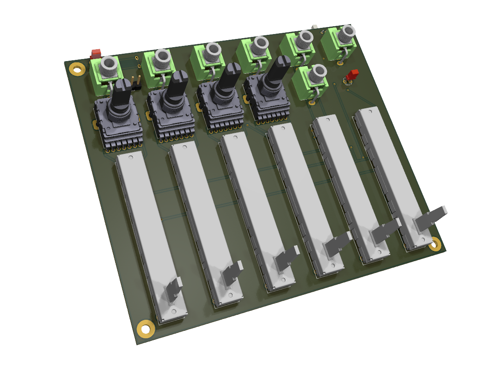

# mixerli

Battery powered 10 channel (4x2 + 1x2) stereo mixer featuring stereo input level control slider and stereo rotary aux send level control.

# Documentation

* [Build guide](documentation/build_guide.pdf)
* [Schematics](documentation/schematics/v2.0/mixerli_schematics_v2.0.1.pdf)

# License

SPDX-FileCopyrightText: 2023 Stahl office@stahlnow.com
SPDX-License-Identifier: CERN-OHL-S-2.0+

This source describes Open Hardware and is licensed under the CERN-OHL-S v2
or any later version.

You may redistribute and modify this source and make products using it
under the terms of the CERN-OHL-S v2 or any later version
(https://ohwr.org/cern_ohl_s_v2.txt).

This source is distributed WITHOUT ANY EXPRESS OR IMPLIED
WARRANTY, INCLUDING OF MERCHANTABILITY, SATISFACTORY
QUALITY AND FITNESS FOR A PARTICULAR PURPOSE. Please see
the CERN-OHL-S v2 for applicable conditions.

Source location: https://github.com/stahlnow/mixerli

As per CERN-OHL-S v2 section 4, should You produce hardware based
on this source, You must where practicable maintain the Source Location
visible on the printed circuit board of the mixerli or other products you make using this source.
